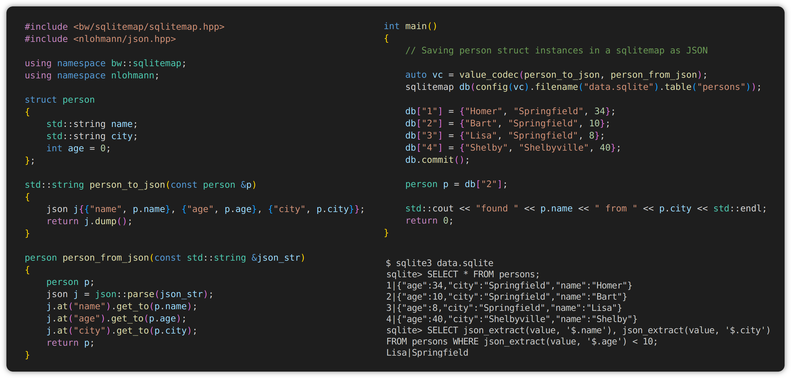

[project_name]: sqlitemap

# sqlitemap — Persistent Map Backed by SQLite



[](https://github.com/bw-hro/sqlitemap/actions/workflows/ubuntu.yml)
[](https://github.com/bw-hro/sqlitemap/actions/workflows/windows.yml)
[](https://github.com/bw-hro/sqlitemap/actions/workflows/macos.yml)
[](https://bw-hro.github.io/sqlitemap/coverage-report)
[](https://raw.githubusercontent.com/bw-hro/sqlitemap/main/LICENSE.txt)
[](https://github.com/bw-hro/sqlitemap/releases)
[](https://vcpkg.link/ports/bw-sqlitemap)

**sqlitemap** is a lightweight C++ wrapper around SQLite that provides a simple, map-like interface.  
It’s designed to make working with key-value storage easy and convenient — similar to how [sqlitedict](https://github.com/piskvorky/sqlitedict) works in the Python world.
The library is implemented as a **single-header** file, making integration easy and is licensed under the **MIT License**.

## Features

- Persistent key-value storage using SQLite
- Easy-to-use map-like interface in C++
- Transactions
- Custom encoding/decoding
- Minimal dependencies (just requires [SQLite](https://sqlite.org))

## Installation

- Just include the [sqlitemap.hpp](https://github.com/bw-hro/sqlitemap/releases/latest/download/sqlitemap.hpp) file into your project source files:
- Make sure that [SQLite](https://sqlite.org) is available

```c++
#include <bw/sqlitemap/sqlitemap.hpp>
```
You can also use the *vcpkg* port `bw-sqlitemap`

```sh
vcpkg install bw-sqlitemap
```

or add dependency to *vcpkg.json* manifest file

```json
{
  "name": "your-project",
  "version-string": "1.0.1",
  "dependencies": [
    "bw-sqlitemap"
  ]
}
```


## Usage

### Write

```c++
#include <bw/sqlitemap/sqlitemap.hpp>

int main()
{
    bw::sqlitemap::sqlitemap db("example.sqlite");

    db["a"] = "first-item";
    db["b"] = "second-item";
    db["c"] = "third-item";

    // Commit to save items
    db.commit();

    db["d"] = "yet-another-item";
    // Forgot to commit here, that item will never be saved.
    db.close();

    // Always remember to commit, or enable autocommit with
    //
    //     bw::sqlitemap::sqlitemap db(bw::sqlitemap::config()
    //        .file("example.sqlite")
    //        .auto_commit(true));
    //
    // Autocommit is off by default for performance.


    db.connect(); // reconnect, after close
    // some additional helpful write methods, among others:
    db.set("x", "draft");     // set or update value
    db.del("x");              // delete value
    db.emplace("y", "draft"); // insert value if not exists
    db.erase("y");            // delete value returns number 0 if not exists, 1 otherwise
    db.insert(std::pair{"z", "draft"}); // insert value, returns iterator to the inserted item
                                        // attention: iterator can not be advanced,
                                        // it can only be used to access the value
    db.clear(); // clear all items
}
```

### Read

```c++
#include <bw/sqlitemap/sqlitemap.hpp>

int main()
{
    bw::sqlitemap::sqlitemap db("example.sqlite");
    std::cout << "There are " << db.size() << " items in the database" << std::endl;
    // There are 3 items in the database

    // Standard map like interface. operator[], iterator, ...

    for (auto& [key, value] : db)
    {
        std::cout << key << " = " << value << std::endl;
    }
    // a = first-item
    // b = second-item
    // c = third-item

    std::string value_a = db["a"];
    std::cout << "value of a: " << value_a << ", value of b: " << db["b"] << std::endl;
    // value of a: first-item, value of b: second-item

    // some additional helpful access methods, among others:
    db.get("a");      // returns value or throws sqlitemap_error if not found
    db.try_get("b");  // returns std::optional containing value or empty if not found
    db.find("c");     // returns iterator to the found item or end() if not found, attention: iterator
                      // can not be advanced, it can only be used to access the value
    db.contains("d"); // returns true if key is found, false otherwise
    db.count("e");    // returns number of items with the given key, 0 or 1
}
```

### Database Connection Lifecycle

The **sqlitemap** object manages the lifecycle of the SQLite database connection. When the object is created, it automatically connects to the database. When the object goes out of scope and is destroyed, it ensures that the database connection is properly closed.

```c++
{
    bw::sqlitemap::sqlitemap db("example.sqlite");
    // The database connection is opened and ready for work
    db["key"] = "value";
    db.commit();
    // The database connection is automatically closed when `db` goes out of scope.
    // db.connect() and db.close() can be used for manual connection management.
}
```

### Transactions

**sqlitemap** provides transaction management to ensure data consistency and performance. By default, **sqlitemap** does not auto-commit changes for performance reasons, allowing you to group multiple operations into a single transaction. When autocommit is used, the beginning of a multiple command spanning transaction must be stated explicitly.

#### Explicit Transactions

You can explicitly control transactions using the `begin_transaction()`, `commit()` and `rollback()` methods:

- **`begin_transaction()`**: Starts a new transaction explicitly. (required  when autocommit is used)
- **`commit()`**: Saves all changes made during the current transaction to the database.
- **`rollback()`**: Discards all changes made during the current transaction.


```c++
#include <bw/sqlitemap/sqlitemap.hpp>

int main()
{
    bw::sqlitemap::sqlitemap db("example.sqlite"); // no autocommit active

    try
    {
        // Write operations implicitly begins a new transaction
        // db.begin_transaction() can be used to  make it explicit
        db["key1"] = "value1";
        db["key2"] = "value2";

        // Commit the transaction to save changes
        db.commit();

        db["key3"] = "value3";
        throw std::runtime_error("An error occurred");

        // This line will not be reached, and the changes to "key3" will not be saved
        db.commit();
    }
    catch (const std::exception& e)
    {
        std::cerr << "Exception: " << e.what() << std::endl;

        // Rollback the transaction to discard uncommitted changes
        db.rollback();

        // Use alternative value in error case
        db["key3"] = "alt_value3";
        db.commit();
    }
}
```

If you prefer not to manage transactions manually, you can enable auto-commit mode. In this mode, every write operation is immediately committed to the database until you explicitly state a new transaction.


```c++
#include <bw/sqlitemap/sqlitemap.hpp>

int main()
{
    bw::sqlitemap::sqlitemap db(bw::sqlitemap::config()
        .file("example.sqlite")
        .auto_commit(true)); // Enable auto-commit mode

    db["key1"] = "value1"; // Automatically committed
    db["key2"] = "value2"; // Automatically committed

    // begin new transaction explicitly
    db.begin_transaction();
    db["key3"] = "value3";
    db["key4"] = "value4";

    // Rollback the transaction to discard uncommitted changes
    db.rollback();
}
```

### Tables

A database file can store multiple tables. The default table "unnamed" is used when no table name is specified.

```c++
#include <bw/sqlitemap/sqlitemap.hpp>

int main()
{
    bw::sqlitemap::sqlitemap db(bw::sqlitemap::config()
        .file("example.sqlite")
        .auto_commit(true));
    
    db["k1"] = "v1";
    db["k2"] = "v2";

    bw::sqlitemap::sqlitemap cities(bw::sqlitemap::config()
        .file("example.sqlite")
        .table("cities")
        .auto_commit(true));

    cities["rostock"] = "https://en.wikipedia.org/wiki/Rostock";
    cities["raleigh"] = "https://en.wikipedia.org/wiki/Raleigh";
    cities["dalian"] = "https://en.wikipedia.org/wiki/Dalian";

    bw::sqlitemap::sqlitemap countries(bw::sqlitemap::config()
        .file("example.sqlite")
        .table("countries")
        .auto_commit(true));

    countries["germany"] = "https://en.wikipedia.org/wiki/Germany";
    countries["usa"] = "https://en.wikipedia.org/wiki/United_States";
    countries["china"] = "https://en.wikipedia.org/wiki/China";

    auto tables = bw::sqlitemap::get_tablenames("example.sqlite");
    // tables contains {"cities", "countries", "unnamed"}
}
```

### Operation modes

**sqlitemap** supports several operation modes that define how the database and its tables are handled. These modes can be configured using the `operation_mode` enum.

#### Available Modes

- **`operation_mode::c` (Create/Default)**: Opens the database in read-write mode. If the database or table does not exist, it will be created.
- **`operation_mode::r` (Read-Only)**: Opens the database in read-only mode. No modifications are allowed.
- **`operation_mode::w` (Write/Drop)**: Opens the database in read-write mode but drops the contents of the specified table before use.
- **`operation_mode::n` (New)**: Creates a new database, erasing all existing tables.

```c++
#include <bw/sqlitemap/sqlitemap.hpp>

int main()
{
    using namespace bw::sqlitemap;

    // Open database in read-only mode
    sqlitemap db_readonly(config()
        .file("example.sqlite")
        .mode(operation_mode::r));
}
```
In addition to the application-level `operation_mode`, the behavior of underlying SQLite database can be configured using [PRAGMA statements](https://www.sqlite.org/pragma.html). **sqlitemap** provides a convenient API to set these pragmas, which are executed when the connection to the database is established.

An example of configuring **sqlitemap** to optimize for high-concurrency workloads.

```c++
#include <bw/sqlitemap/sqlitemap.hpp>

int main()
{
    using namespace bw::sqlitemap;

    sqlitemap sm(config()
        .filename("example.sqlite")
        .pragma("journal_mode", "WAL") // DELETE | TRUNCATE | PERSIST | MEMORY | WAL | OFF
        .pragma("cache_size", -64000)   // -64000 = 64000KiB, 64000 = number of pages
        .pragma("temp_store = 2")      // 0 = DEFAULT, 1 = FILE, 2 = MEMORY
        .pragma("PRAGMA synchronous = NORMAL")); // 0 = OFF, 1 = NORMAL, 2 = FULL

        // configuration.pragma(...) accepts a whole statement, or a flag-value pair
        // it prepends statements with "PRAGMA " when this prefix is missing
}
```

### Encoding/Decoding

**sqlitemap** supports custom encoding and decoding mechanisms for both keys and values to handle complex data types. By default, **sqlitemap** works with simple key-value pairs of `std::string`. However, you can define custom codecs to serialize and deserialize more complex types, such as structs or user-defined objects.


```c++
#include <bw/sqlitemap/sqlitemap.hpp>

// point, feature definded in test/catch2/unit_tests/custom.hpp

int main()
{
    using namespace bw::testhelper;

    auto kc = key_codec([](point p) { return point::to_string(p); },
                        [](std::string s) { return point::from_string(s); });

    auto vc = value_codec([](feature f) { return feature::to_string(f); },
                          [](std::string s) { return feature::from_string(s); });

    // configure custom key and value codecs
    sqlitemap db(config(kc, vc));

    // working with point/feature directly encoding/decoding will be applied automatically
    db.set({0, 0, 0}, {"origin", 5});
    db[{0, 0, 0}] == feature{"origin", 5}; // true

    db[{1, 0, 0}] = {"x-direction", 1};
    db.get({1, 0, 0}) == feature{"x-direction", 1}; // true
}
```
- [sqlitemap_cereal.cpp](examples/sqlitemap_cereal.cpp) demonstrates how to use **sqlitemap** with custom data types stored as blob using [cereal](https://github.com/USCiLab/cereal).
- [sqlitemap_json.cpp](examples/sqlitemap_json.cpp) demonstrates how to use **sqlitemap** with custom data types stored as json string using [nlohmann::json](https://github.com/nlohmann/json).
- [sqlitemap_tiles.cpp](examples/sqlitemap_tiles.cpp) demonstrates how to use **sqlitemap** with custom data types stored as blobs.
- Please make sure to also inspect [sqlitemap_codecs_tests.cpp](test/catch2/unit_tests/sqlitemap_codecs_tests.cpp) were further details regarding encoding/decoding using codecs are covered.

## Tests / Examples / Additional Documentation

- **sqlitemap** is extensively covered by [unit tests](test), which also serve as documentation and usage examples.
- Additionally, [sqlitemap_client](examples/sqlitemap_client.cpp) is a command-line wrapper around **sqlitemap** that demonstrates and covers its most important features and how to embed it into your own project. An executable can be found in the release section.
